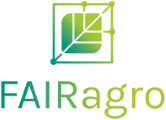

# FAIRagro Knowledgebase
{ align=left }

_Herzlich Willkommen in der FAIRagro Knowledgebase!_

Wenn ihr mehr über das Projekt FAIRagro wissen wollt, schaut auch gerne auf unsere [Website](https://fairagro.net).
  TEST
--- 

## Themen
In unserer Knowledgebase findet ihr Inhalte zu den folgenden Themen:

- [Grundlagen des FDM](basics.de.md)
- Agrarspezifisches FDM
	- [Agrarspezifische Daten](rdm/specific_data.de.md)
	- [Repositorien](rdm/data_repositories.de.md)
	- [FAIRe Code-Veröffentlichung](rdm/fair_code.de.md)
	- [Recht im FDM](rdm/legal.de.md)
	- [Leitfaden Data Handling](rdm/data_handling.de.md)
	- [Leitfaden Projektplanung](rdm/project_planning.de.md)
- [Trainingsmaterialien](training_material.de.md)
- [FAIRagro Tools & Services](tools.de.md)
- Sonstiges
	- [Interessante Projekte](projects.de.md)
	- [Links](links.de.md)

---

## Fragen & Anmerkungen
_Sind noch Fragen offen geblieben oder habt ihr sonstige Anmerkungen?_

Wendet euch gerne an unseren [FAIRagro Helpdesk](https://fairagro.net/helpdesk)! Wir freuen uns von euch zu hören.

## Kontakt
Die FAIRagro Knowledgebase wird betrieben vom FAIRagro DSSC (Data Steward Service Center, [dataservice@fairagro.net](mailto:dataservice@fairagro.net)).
