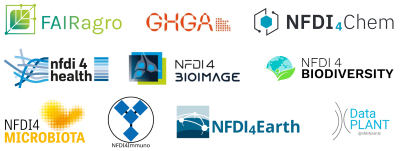

# Links & weiterführende Informationen

## Allgemeines Forschungsdatenmanagement (FDM)
Eine Sammlung von Links zum Nachlesen allgemeiner (generischer) FDM Inhalte findet ihr [hier](basics.de.md).

## Weitere Knowledgebases im NFDI Geo-Chem-Lifescience-Cluster
{ align=right }

Das Geo-Chem-Lifescience-Cluster der Nationalen Forschungsdateninfrastruktur e.V. ([NFDI](https://www.nfdi.de/)) besteht aus einem losen Zusammenschluss der Konsortien [NFDI4Earth](https://www.nfdi4earth.de/), [NFDI4Chem](https://www.nfdi4chem.de/de/), [DataPlant](https://nfdi4plants.org/), [NFDI4Biodiversity](https://www.nfdi4biodiversity.org/de/), [NFDI4Microbiota](https://nfdi4microbiota.de/), [NFDI4BIOIMAGE](https://nfdi4bioimage.de/home/), [NFDI4Immuno](https://www.nfdi4immuno.de/), [GHGA](https://www.ghga.de/de/), [NFDI4Health](https://www.nfdi4health.de/) und [FAIRagro](https://fairagro.net/).

Die Knowledgebases dieser Konsortien findet ihr hier:

- [Knowledgebase NFDI4Chem](https://knowledgebase.nfdi4chem.de/knowledge_base/de/docs/intro/)
- [Knowledgebase DataPlant](https://nfdi4plants.github.io/nfdi4plants.knowledgebase/) (_nur in Englisch verfügbar_)
- [Knowledgebase NFDI4Biodiversity](https://kb.gfbio.org/display/KB/Knowledge+Base+-+Information+and+Services+around+Biodiversity+Data) (_großteils nur in Englisch verfügbar_)
- [Knowledgebase NFDI4Microbiota](https://knowledgebase.nfdi4microbiota.de/Getting-Started/01-introduction.html) (_nur in Englisch verfügbar_)
